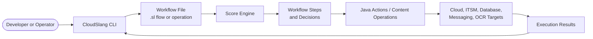

<p align="center">
	
</p>

<p align="center">
	<a href="https://github.com/CloudSlang/cloud-slang">
		
	</a>
	<a href="https://github.com/CloudSlang/score">
		
	</a>
	<a href="https://github.com/CloudSlang/cs-content">
		
	</a>
	<a href="https://github.com/CloudSlang/cs-actions">
		
	</a>
</p>

# CloudSlang

## Overview

CloudSlang is an open-source workflow automation and orchestration project centered on a YAML-based language, an execution engine, a CLI, reusable content packs, and developer tooling. The organization brings together the core runtime, ready-made automations, Java actions, SDKs, editors, packaging utilities, documentation, and test assets needed to build and run orchestration at scale.

## Top Integrations

The integrations below are extracted from the CloudSlang content ecosystem and link directly to their respective sections in [cs-content](https://github.com/CloudSlang/cs-content/tree/WS_2_0/content/io/cloudslang).

<p align="center">
	<a href="https://github.com/CloudSlang/cs-content/tree/WS_2_0/content/io/cloudslang/amazon/aws">
		
	</a>
	<a href="https://github.com/CloudSlang/cs-content/tree/WS_2_0/content/io/cloudslang/microsoft/azure">
		
	</a>
	<a href="https://github.com/CloudSlang/cs-content/tree/WS_2_0/content/io/cloudslang/google">
		
	</a>
	<a href="https://github.com/CloudSlang/cs-content/tree/WS_2_0/content/io/cloudslang/alibaba/ecs">
		
	</a>
	<a href="https://github.com/CloudSlang/cs-content/tree/WS_2_0/content/io/cloudslang/oracle/oci">
		
	</a>
</p>

<p align="center">
	<a href="https://github.com/CloudSlang/cs-content/tree/WS_2_0/content/io/cloudslang/docker">
		
	</a>
	<a href="https://github.com/CloudSlang/cs-content/tree/WS_2_0/content/io/cloudslang/kubernetes">
		
	</a>
	<a href="https://github.com/CloudSlang/cs-content/tree/WS_2_0/content/io/cloudslang/openshift">
		
	</a>
	<a href="https://github.com/CloudSlang/cs-content/tree/WS_2_0/content/io/cloudslang/openstack">
		
	</a>
	<a href="https://github.com/CloudSlang/cs-content/tree/WS_2_0/content/io/cloudslang/vmware">
		
	</a>
</p>

<p align="center">
	<a href="https://github.com/CloudSlang/cs-content/tree/WS_2_0/content/io/cloudslang/hashicorp">
		
	</a>
	<a href="https://github.com/CloudSlang/cs-content/tree/WS_2_0/content/io/cloudslang/jenkins">
		
	</a>
	<a href="https://github.com/CloudSlang/cs-content/tree/WS_2_0/content/io/cloudslang/atlassian/jira">
		
	</a>
	<a href="https://github.com/CloudSlang/cs-content/tree/WS_2_0/content/io/cloudslang/itsm/service_now">
		
	</a>
	<a href="https://github.com/CloudSlang/cs-content/tree/WS_2_0/content/io/cloudslang/twilio/sms">
		
	</a>
</p>

<p align="center">
	<a href="https://github.com/CloudSlang/cs-content/tree/WS_2_0/content/io/cloudslang/cyberark/privileged_access_manager">
		
	</a>
	<a href="https://github.com/CloudSlang/cs-content/tree/WS_2_0/content/io/cloudslang/new_relic/servers">
		
	</a>
	<a href="https://github.com/CloudSlang/cs-content/tree/WS_2_0/content/io/cloudslang/nutanix/prism">
		
	</a>
	<a href="https://github.com/CloudSlang/cs-content/tree/WS_2_0/content/io/cloudslang/couchbase">
		
	</a>
	<a href="https://github.com/CloudSlang/cs-content/tree/WS_2_0/content/io/cloudslang/postgresql">
		
	</a>
</p>

<p align="center">
	<a href="https://github.com/CloudSlang/cs-content/tree/WS_2_0/content/io/cloudslang/chef">
		
	</a>
	<a href="https://github.com/CloudSlang/cs-content/tree/WS_2_0/content/io/cloudslang/consul">
		
	</a>
	<a href="https://github.com/CloudSlang/cs-content/tree/WS_2_0/content/io/cloudslang/digital_ocean/v2">
		
	</a>
	<a href="https://github.com/CloudSlang/cs-content/tree/WS_2_0/content/io/cloudslang/heroku">
		
	</a>
	<a href="https://github.com/CloudSlang/cs-content/tree/WS_2_0/content/io/cloudslang/git">
		
	</a>
</p>

<p align="center">
	<a href="https://github.com/CloudSlang/cs-content/tree/WS_2_0/content/io/cloudslang/maven">
		
	</a>
	<a href="https://github.com/CloudSlang/cs-content/tree/WS_2_0/content/io/cloudslang/redhat">
		
	</a>
	<a href="https://github.com/CloudSlang/cs-content/tree/WS_2_0/content/io/cloudslang/abbyy/cloud">
		
	</a>
	<a href="https://github.com/CloudSlang/cs-content/tree/WS_2_0/content/io/cloudslang/tesseract/ocr">
		
	</a>
	<a href="https://github.com/CloudSlang/cs-content/tree/WS_2_0/content/io/cloudslang/microfocus">
		
	</a>
</p>

## What You Will Find Here

- **Language, engine, and CLI** for building and running CloudSlang flows
- **Reusable content packs** for cloud, infrastructure, ITSM, messaging, OCR, databases, and more
- **Java actions and SDKs** for extending integrations programmatically
- **Docs, website, and editor integrations** for onboarding and productivity
- **Utilities, generators, packagers, and tests** for contributor and release workflows

## Architecture Diagram



## Quick Start

Start with [cloud-slang](https://github.com/CloudSlang/cloud-slang) for the CLI and runtime, and [cs-content](https://github.com/CloudSlang/cs-content) for reusable workflows.

### 1. Download the CLI Bundle

Get the latest CloudSlang CLI bundle from:

- [Stable release](https://github.com/CloudSlang/cloud-slang/releases/latest)
- [All releases](https://github.com/CloudSlang/cloud-slang/releases)

### 2. Launch the CLI

From the extracted package, run:

```powershell
cd cslang\bin
./cslang.bat
```

On Linux:

```bash
cd cslang/bin
bash cslang
```

### 3. Run a Simple Workflow

Example: run the built-in print flow from the content pack.

```bash
run --f ../content/io/cloudslang/base/print/print_text.sl --i text=first_flow --cp ../content/
```

### 4. Run an Integration Workflow

Example: use an integration-specific flow from the content repository after cloning [cs-content](https://github.com/CloudSlang/cs-content).

```bash
run --f ../content/io/cloudslang/twilio/sms/send_sms.sl --i account_sid=<your_sid>,auth_token=<your_token>,from_number=<sender>,to_number=<recipient>,message=Hello --cp ../content/
```

### 5. Know Which Parts Are CLI Inputs

In CloudSlang examples, these sections are command inputs that you replace with your own values:

```text
--f   path to the flow file you want to run
--i   input values passed to the flow
--cp  classpath pointing at the content root
```

Example with placeholders shown explicitly:

```bash
run --f <path_to_flow.sl> --i input1=value1,input2=value2 --cp <content_root>
```

### 6. Where To Go Next

- Use [cs-content](https://github.com/CloudSlang/cs-content) to explore ready-made automations.
- Use [cs-actions](https://github.com/CloudSlang/cs-actions) if you need Java-based integration logic.
- Use [docs](https://github.com/CloudSlang/docs) and [cloudslang.io](http://www.cloudslang.io/) for platform documentation.

## Core Repositories

- [cloud-slang](https://github.com/CloudSlang/cloud-slang): CloudSlang language, CLI, builder, compiler, runtime, and validation stack.
- [score](https://github.com/CloudSlang/score): The CloudSlang orchestration engine.
- [cs-content](https://github.com/CloudSlang/cs-content): Ready-made CloudSlang flows and operations across many integrations.
- [cs-actions](https://github.com/CloudSlang/cs-actions): Java actions used by CloudSlang content packs.
- [docs](https://github.com/CloudSlang/docs): Documentation source.
- [CloudSlang.github.io](https://github.com/CloudSlang/CloudSlang.github.io): Website source.

## Contribution Guidelines

We welcome external contributions, including first-time contributors.

- Start with [Issues](https://github.com/orgs/CloudSlang/repositories) in the repository closest to your change.
- For orchestration content, start in [cs-content](https://github.com/CloudSlang/cs-content).
- For Java-based integration logic, start in [cs-actions](https://github.com/CloudSlang/cs-actions).
- For core language, CLI, compiler, or runtime work, start in [cloud-slang](https://github.com/CloudSlang/cloud-slang) and [score](https://github.com/CloudSlang/score).
- For docs or onboarding improvements, use [docs](https://github.com/CloudSlang/docs) or [CloudSlang.github.io](https://github.com/CloudSlang/CloudSlang.github.io).
- Please keep changes focused, include validation where possible, and follow each repository's `CONTRIBUTING.md` and DCO requirements.

## Useful Resources

- Website: [cloudslang.io](http://www.cloudslang.io/)
- Documentation: [CloudSlang docs](https://github.com/CloudSlang/docs)
- Core platform: [cloud-slang](https://github.com/CloudSlang/cloud-slang)
- Engine: [score](https://github.com/CloudSlang/score)
- Ready-made automations: [cs-content](https://github.com/CloudSlang/cs-content)
- Java actions: [cs-actions](https://github.com/CloudSlang/cs-actions)
- Org repositories: [CloudSlang repositories](https://github.com/orgs/CloudSlang/repositories)

## Repository Map

### Platform and Runtime

| Repository | Summary |
|---|---|
| [cloud-slang](https://github.com/CloudSlang/cloud-slang) | CloudSlang language, CLI, builder, compiler, validator, and runtime modules. |
| [score](https://github.com/CloudSlang/score) | Orchestration engine for executing CloudSlang flows. |
| [cloudslang-webapp](https://github.com/CloudSlang/cloudslang-webapp) | Spring Boot web application with REST API for CloudSlang. |

### Content, Actions, and SDKs

| Repository | Summary |
|---|---|
| [cs-content](https://github.com/CloudSlang/cs-content) | Ready-made CloudSlang flows and operations for a broad set of integrations. |
| [cs-actions](https://github.com/CloudSlang/cs-actions) | Java actions that back CloudSlang content integrations. |
| [score-content-sdk](https://github.com/CloudSlang/score-content-sdk) | SDK support for building Score and CloudSlang content integrations. |
| [cs-openstack](https://github.com/CloudSlang/cs-openstack) | OpenStack integration repository. |
| [cs-couchbase](https://github.com/CloudSlang/cs-couchbase) | Couchbase-related content and test repository. |
| [cs-jenkins](https://github.com/CloudSlang/cs-jenkins) | Java actions for the Jenkins integration. |
| [cs-oo-management](https://github.com/CloudSlang/cs-oo-management) | OO flows for managing an OO/RPA instance and its core components. |

### Tooling, Packaging, and Automation

| Repository | Summary |
|---|---|
| [cs-content-packager](https://github.com/CloudSlang/cs-content-packager) | Generates the artifacts required to build a content pack. |
| [cs-content-generator](https://github.com/CloudSlang/cs-content-generator) | Generates `.sl` files from Java actions. |
| [CloudSlang-Docker-Image](https://github.com/CloudSlang/CloudSlang-Docker-Image) | Docker image packaging for the CloudSlang CLI. |
| [cs-npm](https://github.com/CloudSlang/cs-npm) | npm packaging for `cloudslang-cli`. |
| [test-functional](https://github.com/CloudSlang/test-functional) | Global functional tests for the CLI and builder. |
| [example_project](https://github.com/CloudSlang/example_project) | Sample project for testing and onboarding scenarios. |

### Docs, Site, and IDE Support

| Repository | Summary |
|---|---|
| [docs](https://github.com/CloudSlang/docs) | Documentation source repository. |
| [CloudSlang.github.io](https://github.com/CloudSlang/CloudSlang.github.io) | Website source for CloudSlang. |
| [cs-intellij-plugin](https://github.com/CloudSlang/cs-intellij-plugin) | IntelliJ IDEA plugin for CloudSlang. |
| [cs-vscode](https://github.com/CloudSlang/cs-vscode) | Visual Studio Code language support for CloudSlang. |
| [atom-cloudslang-package](https://github.com/CloudSlang/atom-cloudslang-package) | Atom editor package for CloudSlang support. |

## Team Notes

Coffee, clean builds, reusable flows, and integration coverage tend to show up early and often.

You can do mighty things with the power of [Markdown](https://docs.github.com/github/writing-on-github/getting-started-with-writing-and-formatting-syntax).
